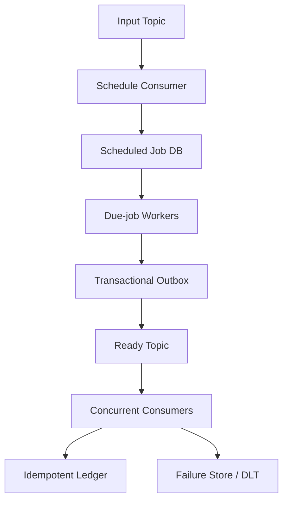

## 요약

Kafka 기반 이벤트 처리 시스템에서 Confluent Parallel Consumer(이하 PC)를 사용하던 중, 리밸런싱 이후 일부 파티션의 consume이 멈추고 lag이 계속 증가하는 현상이 발생했다. 프로세스는 살아 있었지만 처리는 진전되지 않았고, Pod를 재시작해 group membership과 메모리 상태를 초기화하자 적체가 해소됐다.

현재 가장 유력한 가설은 PC가 관리하는 `WorkContainer`, partition state, retry state와 offset commit이 리밸런싱 과정에서 충돌해 발생한 **revoke/commit deadlock 또는 state race condition**이다. 다만 사건 당시의 thread dump가 없어 확정된 root cause는 아니다.

운영상 이 현상은 [upstream #857](https://github.com/confluentinc/parallel-consumer/issues/857)과 유지보수 포크의 [tracking issue #119](https://github.com/astubbs/parallel-consumer/issues/119)가 다루는 **silent-stall/no-progress 증상군**으로 분류할 수 있다. 그러나 이 증상군에는 여러 독립적인 결함이 포함돼 있으므로, “여러 client가 동시에 멈췄다”는 사실만으로 특정 deadlock과 동일한 원인이라고 단정해서는 안 된다.

PC 공식 저장소는 더 이상 유지보수되지 않는다. 따라서 장기적으로는 PC를 제거하고 다음과 같이 책임을 분리하는 방향이 적절하다.

- 병렬 처리: 표준 Kafka Consumer Group과 Spring Kafka concurrency
- 지연 실행: 별도의 delay scheduler
- 전달 보장: at-least-once를 전제로 한 idempotency
- 중요한 업무 처리: DB Scheduler, Transactional Outbox, 명확한 상태 전이

## 관찰 사실과 가설의 분리

Incident 분석에서 가장 중요한 것은 관찰된 사실과 설명 가설을 구분하는 것이다.

### 관찰된 사실

- 특정 파티션의 consume이 중단되고 lag이 증가했다.
- 리밸런싱이 정상적으로 완료되지 않은 정황이 있었다.
- 프로세스가 종료되지는 않았지만 처리 progress가 멈췄다.
- Pod 재시작 후 새로운 리밸런싱이 수행되며 처리가 재개됐다.
- 비슷한 시점에 여러 client 또는 여러 파티션이 멈춘 사례도 보고됐다.

### 유력 가설

1. 리밸런싱이 시작되고 partition revoke callback이 실행됐다.
2. 동시에 control thread가 offset commit을 진행했다.
3. revoke 경로와 일반 commit 경로가 동일한 동기화 자원 또는 서로의 broker response를 기다렸다.
4. broker poll thread와 control thread가 더 이상 진행하지 못했다.
5. assignment는 남아 있지만 poll, dispatch 또는 commit progress가 멈췄다.

대표적인 AB-BA deadlock은 다음과 같이 설명할 수 있다.

```text
pc-control:
  commit lock 보유
  → broker commit response 대기

pc-broker-poll:
  rebalance callback 실행
  → 동일 commit lock 대기
  → broker response를 처리할 poll도 중단

결과:
  control은 response를 기다리고,
  poll은 control이 보유한 lock을 기다림
```

Pod 재시작으로 회복됐다는 사실은 이 가설과 일치하지만, 그 자체가 원인을 증명하지는 않는다.

## 하나의 증상 뒤에 여러 원인이 있을 수 있다

`#857 silent-stall` 계열에는 다음과 같은 서로 다른 failure mode가 포함될 수 있다.

| 시그니처 | 가능한 원인 |
| --- | --- |
| sync commit, broker-poll은 revoke callback에서 lock 대기, control은 commit response 대기 | revoke/commit AB-BA deadlock 가능성 |
| transactional mode에서 revoke가 transaction 또는 produce lock을 대기 | transactional commit wait |
| 종료 중인 client가 poll하지 않으면서 assignment와 heartbeat 유지 | zombie assignment |
| paused partition, epoch mismatch, stale work skip가 함께 관찰됨 | stale partition/WC state |
| async commit, group은 STABLE, heartbeat 정상, lag만 고정 | 기존 deadlock으로 설명되지 않는 별도 stall |
| lag이 있는데 poll이 계속 0건 반환 | broker, subscription 또는 미확인 PC 경로 추가 조사 필요 |

관련 공개 분석:

- [upstream #803](https://github.com/confluentinc/parallel-consumer/issues/803): revoke와 commit 경쟁 및 deadlock
- [upstream #857](https://github.com/confluentinc/parallel-consumer/issues/857): 리밸런싱 후 partition consume 정지
- [fork PR #29](https://github.com/astubbs/parallel-consumer/pull/29): revoke와 일반 sync commit 사이의 AB-BA deadlock
- [fork PR #80](https://github.com/astubbs/parallel-consumer/pull/80): draining consumer의 zombie assignment
- [fork PR #100](https://github.com/astubbs/parallel-consumer/pull/100): rebalance exception 이후 broker-poll thread 종료
- [fork tracking #119](https://github.com/astubbs/parallel-consumer/issues/119): 여러 silent-stall 원인 통합 추적

따라서 운영 대응은 하나의 incident family로 묶되, RCA에서는 commit mode와 thread dump가 일치할 때만 특정 subtype으로 확정해야 한다.

## 다음 장애에서 반드시 수집할 증거

재시작 전에 모든 client에서 같은 시간 기준으로 다음 자료를 남겨야 한다.

- PC, Kafka client 버전과 commit/ordering mode
- 10~30초 간격의 thread dump 2~3회
- `pc-broker-poll`, `pc-control`, worker와 transaction 관련 thread stack
- consumer group state, generation과 client별 assignment
- partition별 committed offset, log-end offset과 lag 변화
- paused partition, inflight work와 incomplete offset 수
- 마지막 dispatch, complete, commit 시각
- Pod rollout, autoscaling, CPU throttling, GC pause와 network event
- `RebalanceInProgressException`, commit timeout, epoch mismatch, lost partition 관련 로그

권장 임시 분류는 다음과 같다.

```yaml
incident_family: "Parallel Consumer silent-stall / no-progress"
scope: "multiple clients or partitions"
primary_hypothesis: "rebalance 중 PC 내부 state 정합성 문제"
suspected_subtype: "revoke-commit AB-BA deadlock"
root_cause_status: "unconfirmed"
```

## PC가 복잡해진 이유

PC는 한 파티션에서 여러 record를 동시에 처리하기 위해 client 내부에서 다음 상태를 관리한다.

- 처리 중, 성공, 실패와 retry 예정 record
- partition별 incomplete offset
- 연속적으로 commit 가능한 가장 높은 offset
- ordering을 위한 shard
- retry delay와 stale work
- revoke와 재할당 사이의 assignment epoch

이 구조에서는 worker가 offset 12를 완료해도 offset 11이 끝나지 않았다면 13으로 commit할 수 없다. 리밸런싱 시에는 완료되지 않은 work, retry queue, stale epoch의 결과까지 정리해야 한다. 결국 poll, worker, control thread 사이에 복잡한 상태 조정이 필요하다.

이 기능을 제거하면서 다음과 같은 구조를 직접 만들면 PC의 복잡성을 인하우스로 재구현하는 셈이다.

```text
KafkaConsumer.poll()
  → 공용 executor
  → 완료 offset과 중간 hole 직접 계산
  → revoke 시 inflight work 정리
  → 수동 pause/resume과 commit
```

핵심 원칙은 **Kafka에는 assignment와 offset을 맡기고, 애플리케이션은 업무 상태만 관리하는 것**이다.

## 기능별 대체안

### 병렬 처리

표준 Kafka Consumer Group과 Spring Kafka의 concurrent listener를 사용한다.

`concurrency=N`은 하나의 `KafkaConsumer`를 여러 thread가 공유하는 방식이 아니다. 독립적인 consumer N개가 같은 group에 참여하고 Kafka가 파티션을 분배한다. Kafka Consumer는 thread-safe하지 않기 때문에 이것이 표준적인 확장 방식이다.

```java
@KafkaListener(
    topics = "event-ready",
    groupId = "event-processor",
    concurrency = "3"
)
public void consume(Event event) {
    eventService.process(event);
}
```

병렬도는 기본적으로 파티션 수를 넘을 수 없다. 최소 두 개 이상의 Pod를 운영하고, 처리량이 더 필요하면 concurrency, Pod 수, 파티션 수의 순서로 조정한다.

### 지연 실행

Kafka consumer가 메시지를 poll한 뒤 30초 또는 2분 동안 메모리와 incomplete offset에 보관해서는 안 된다. 메시지에는 상대 지연값 대신 절대 시각인 `executeAt`을 기록하고, 지연 실행을 offset 관리에서 분리한다.

#### 고정 Delay Topic

지연이 30초와 2분처럼 소수의 고정 구간이고 약간의 시간 오차가 허용된다면 다음 구조를 사용할 수 있다.

```text
Producer
  → delay-30s / delay-2m
  → Delay Router
  → ready topic
  → standard consumer group
```

구조가 가볍지만 head-of-line blocking, 재발행 중복, 지연 구간 증가에 따른 topic 복잡성이 있다.

#### DB Scheduler + Outbox

중요한 처리, 동적 지연, 감사 이력, 취소와 수동 재실행이 필요하면 다음 구조가 더 적합하다.

```text
Input topic
  → Schedule Consumer
  → Scheduled Job DB
  → Due-job Worker
  → Transactional Outbox
  → Ready topic
  → Idempotent Consumer
```

Schedule Consumer는 job 저장을 DB에 commit한 뒤 Kafka offset을 commit한다. Due Worker는 lease 방식으로 due job을 선점하고, job 상태 변경과 outbox 생성을 하나의 DB transaction으로 묶는다. 중복 publish 가능성은 최종 consumer의 idempotency로 흡수한다.

## 전달 보장과 순서

Kafka offset commit과 외부 DB 변경을 하나의 원자적 transaction으로 묶지 않는 한 다음 상황은 항상 가능하다.

```text
업무 DB 처리 성공
→ offset commit 전 프로세스 종료
→ 동일 메시지 재수신
```

따라서 실제 전달 보장은 at-least-once로 보고, 다음과 같은 idempotency key와 DB constraint를 사용해야 한다.

- `(event_id, action_type)`
- `(aggregate_id, event_version, action_type)`
- 조건부 상태 전이
- 처리 이력 또는 ledger의 unique constraint

Delay Topic이나 Scheduler를 거치면 생성 순서와 실행 순서가 달라질 수 있다. consumer ordering만 신뢰하지 말고 aggregate의 현재 상태, event version과 허용된 state transition을 DB에서 검증해야 한다.

## 권장 Target Architecture



책임 경계는 다음과 같다.

| 컴포넌트 | 책임 |
| --- | --- |
| Schedule Consumer | 입력 검증과 scheduled job 저장 |
| Scheduled Job DB | `executeAt`, 상태, lease, retry 이력 |
| Due-job Worker | due job 선점과 outbox 생성 |
| Outbox Publisher | ready topic 발행과 재시도 |
| Ready Consumer | 실제 업무 처리 |
| 업무 DB | idempotency와 유효한 상태 전이 보장 |

## 단기 Containment

PC 제거 전까지는 process health가 아니라 **progress**를 감시해야 한다.

```text
lag > 0
AND committed_offset_delta == 0 for 5 minutes
AND incoming_rate > 0
```

핵심 지표는 다음과 같다.

- partition별 lag와 committed offset delta
- last processed/committed timestamp
- rebalance count와 duration
- commit latency와 failure count
- paused partition 수
- poll/control thread 생존과 progress

No-progress 감지 시 thread dump, group describe와 Pod/broker event를 자동 수집한 뒤 재시작하도록 한다. 자동 재시작은 임시 복구책이므로 cooldown을 두어 rebalance storm을 방지하고, 중복 처리에도 안전한지 먼저 검증해야 한다.

## 마이그레이션 순서

1. 버전, commit/ordering mode, 파티션 수, 처리량과 지연 요구사항을 확정한다.
2. no-progress alert와 자동 증거 수집을 적용하고 idempotency를 강화한다.
3. 표준 consumer와 Spring Kafka concurrency를 별도 group에서 shadow 검증한다.
4. Delay Topic과 DB Scheduler를 동일 workload로 PoC한다.
5. 신규 경로는 dry-run 또는 shadow ledger로 dual run한다.
6. 일부 이벤트 유형부터 canary 전환한다.
7. 기존 PC의 신규 유입을 중단하고 pending work와 lag을 완전히 drain한다.
8. rollback 기간 후 PC dependency와 전용 설정을 제거한다.

검증에는 Pod 강제 종료, rolling deployment, scale up/down, coordinator 변경, worker lease 중단, outbox 중복 publish, 이벤트 중복·순서 역전과 DLT replay가 포함돼야 한다.

성공 기준은 메시지 유실 0건, 중복 side effect 0건, 장애 후 지정 시간 내 처리 재개와 lateness SLO 충족이다.

## 결론

이번 장애는 PC가 client 내부에서 WorkContainer, incomplete offset, retry와 commit state를 여러 thread에 걸쳐 관리하는 구조적 복잡성과 연관됐을 가능성이 높다. 가장 유력한 설명은 리밸런싱 중 revoke commit과 일반 commit의 경쟁 또는 deadlock이지만, 증거가 확보되기 전까지는 가설로 유지해야 한다.

PC의 핵심 용도는 다음 표준 구성으로 대체할 수 있다.

- 여러 파티션의 병렬 처리: 표준 Consumer Group + Spring Kafka concurrency
- 지연 실행: Delay Topic 또는 DB Scheduler
- 신뢰성: Transactional Outbox + idempotent processing
- 순서 보호: DB 기반 version 및 상태 전이 검증

중요한 것은 PC의 WorkContainer와 offset coordination을 다시 만드는 것이 아니다. Kafka에는 파티션과 offset을 맡기고, 애플리케이션은 `executeAt`, idempotency와 업무 상태 전이라는 명확한 책임만 가져야 한다.
