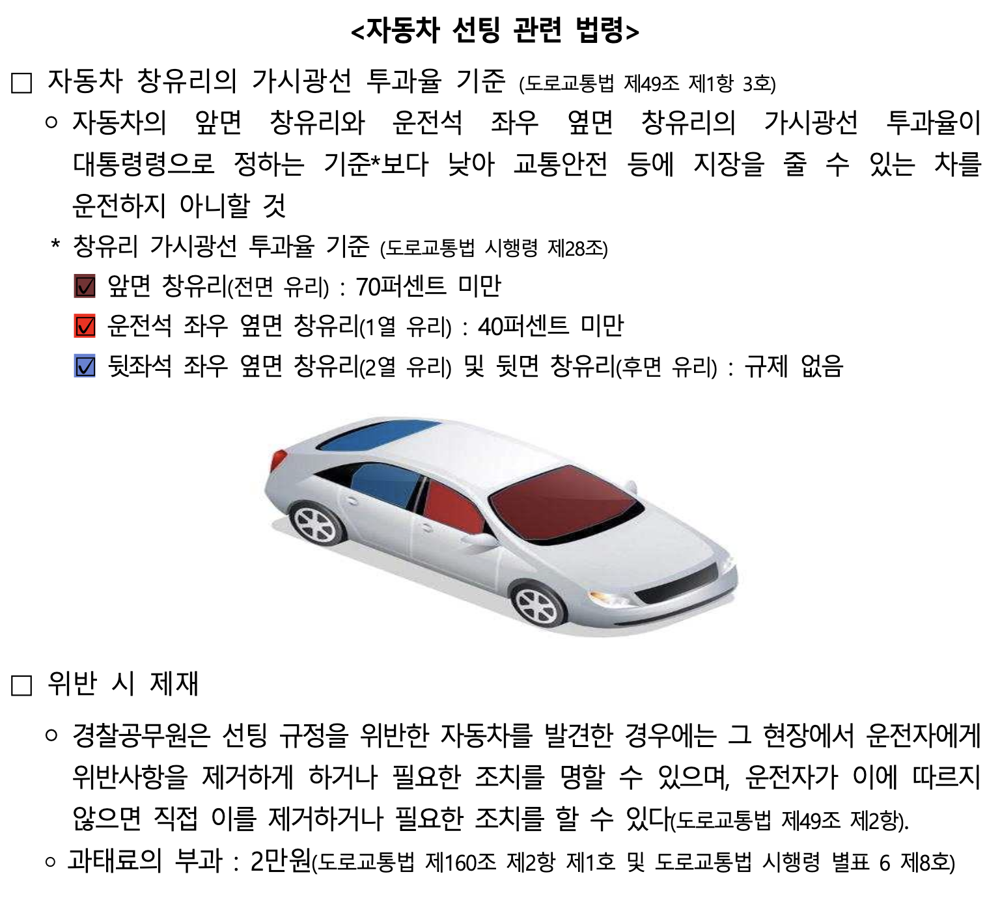
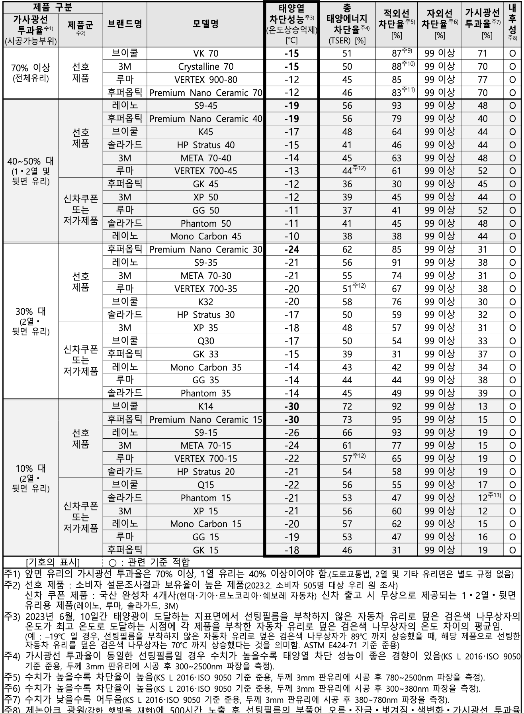
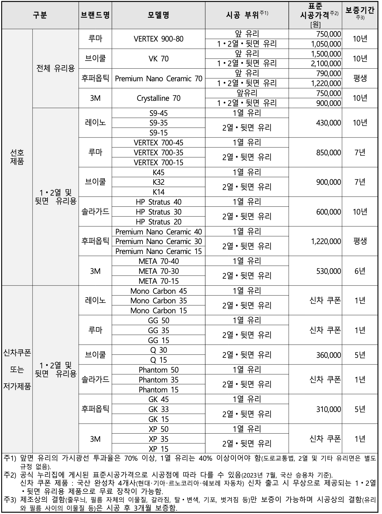
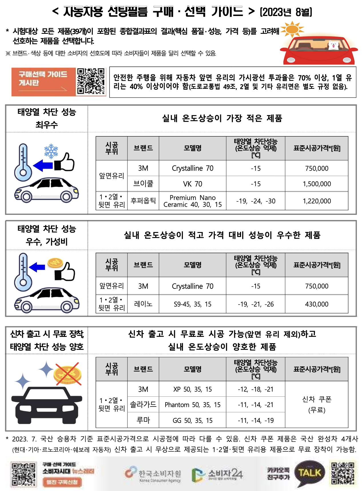

# 0. 틴팅을 하는 이유
자동차 틴팅(선팅)은 “차 안을 안 보이게 만드는 작업”처럼 보이지만, 실제로는 **빛(시야)·열(쾌적함)·시선(프라이버시)**을 관리해서 운전 경험을 바꾸는 작업에 가깝다. 특히 여름 한낮에 차에 탔을 때 느껴지는 열감, 해질녘 역광과 야간 헤드라이트의 눈부심, 주차장/신호대기에서의 시선 스트레스 같은 것들은 생각보다 ‘일상적으로’ 누적된다.

## 0-1. 열(쾌적함) 관리: “차 안이 덜 뜨거워지는” 체감
차량 실내가 뜨거워지는 건 단순히 햇빛이 밝아서가 아니라, 유리를 통과한 태양 에너지(가시광선+적외선 등)가 실내에서 열로 바뀌기 때문이다. 틴팅은 이 에너지 유입을 줄여 **승차 직후 열감**, **에어컨이 버티는 시간**, **장거리 운전 피로**에 영향을 준다.
이때 중요한 포인트는 “어둡게”가 아니라, 필름이 어느 정도의 태양 에너지를 막는지(예: **TSER 같은 지표**)다. 같은 농도처럼 보여도 필름의 등급/종류에 따라 열차단 체감이 크게 달라질 수 있다.

## 0-2. 자외선(UV) 노출 줄이기: 피부와 실내 소재를 동시에 보호
운전이 생활인 사람은 본인도 모르게 자외선 노출이 누적된다. 피부 입장에서는 장시간 노출 자체가 부담이고, 차량 입장에서는 대시보드/시트/내장재가 **변색·경화·노화**로 이어질 수 있다. 틴팅을 하는 큰 이유 중 하나는 이 “누적 데미지”를 줄이는 것이다.

## 0-3. 눈부심(Glare) 감소: 시야를 “잘 보이게”가 아니라 “덜 피곤하게”
역광(해질녘), 젖은 노면 반사, 야간 상대차 헤드라이트는 시야를 단순히 어둡게 만드는 게 아니라 **눈을 피로하게** 만든다. 적절한 틴팅은 이런 눈부심을 줄여 운전자의 피로와 스트레스를 낮추는 데 도움을 줄 수 있다.
단, 여기서 중요한 전제는 “적절한”이다. 과도하게 어두운 틴팅은 야간/우천에서 시야를 깎을 수 있어, 안전 측면에서는 오히려 불리해질 수 있다.

## 0-4. 프라이버시/심리적 안정: 시선 스트레스를 줄이고, 보안도 간접적으로 도움
신호대기나 주차장에서 느끼는 외부 시선은 생각보다 피로 요소가 된다. 틴팅은 외부에서 내부가 덜 보이게 만들어 **심리적 안정감**을 주고, 차 안에 물건이 훤히 보이는 상황을 줄여 **기회범죄(유리 깨고 훔치기)**를 간접적으로 억제하는 효과도 기대할 수 있다.

## 0-5. 유리 파손 시 비산(파편) 완화: 안전성 측면
필름은 유리가 깨질 때 파편이 흩어지는 것을 일부 완화하거나, 깨진 유리가 한 번에 떨어지는 것을 줄이는 데 도움을 줄 수 있다. 다만 이 목적이 크다면 일반 틴팅보다 ‘안전/방범 필름’ 영역에 가까워지고, 필름 두께/시공 품질/인증 여부 같은 요소가 더 중요해진다.

정리하면, 틴팅은 “멋”만을 위한 선택이 아니라 **열(쾌적)·UV(보호)·눈부심(피로)·프라이버시(심리)·파편(안전)**을 동시에 다루는 선택이다. 그리고 가장 흔한 실수는 ‘열차단’을 이유로 **전면/앞좌석을 과도하게 어둡게** 가져가는 것이다. 전면과 1열은 시야가 최우선이고, 열차단은 가능한 한 **필름의 성능(등급)으로 해결**하는 쪽이 후회가 적다.

# 1. 틴팅의 성능 지표(스펙 읽는 법)
### 1-1. 가시광선 투과율(VLT, Visible Light Transmission)
가시광선이 필름을 통해 얼마나 통과하는지를 나타내는 값이다. 숫자가 높을수록 밝고 낮을수록 어둡다.

### 1-2. 총 태양에너지 차단율(TSER, Total Solar Energy Rejected)
태양광에 포함된 자외선, 가시광선, 적외선 등 모든 에너지를 얼마나 차단하는지를 나타내는 지표로, 열 차단 성능을 종합적으로 평가한다.

### 1-3. 적외선 차단율(IRR, Infrared Rejection)
열을 전달하는 적외선을 얼마나 차단하는지를 나타내며, 열 차단 성능의 일부를 평가한다.
> **주의**: IRR은 측정 파장/조건(예: 900nm, 1000nm 등)에 따라 수치가 크게 달라질 수 있어 **숫자만으로 브랜드 간 단순 비교하면 오해**가 생긴다. 비교할 때는 “**몇 nm 기준 IRR인지**”를 반드시 함께 확인하는 편이 안전하다. “열차단”을 한 숫자로 비교할 때는 보통 **TSER이 더 직관적**이고, IRR은 보조 지표로 보는 편이 안전하다.

### 1-4. 자외선 차단율(UVR, Ultraviolet Rejection)
자외선을 얼마나 차단하는지 나타내는 지표로, **피부 보호**와 **실내(대시보드/시트) 변색·노화 억제**와 관련이 있다. 체감은 열차단보다 덜 드러나지만, 장기적으로는 만족도를 좌우하는 요소라서 **전면/1열 기준으로는 필수 체크 항목**이다.

### 1-5. 헤이즈(Haze, 탁도)
유리가 뿌옇게 보이거나 빛 번짐이 생기는 정도와 관련된 지표다. VLT(밝기)가 높아도 헤이즈가 높으면 **야간/우천에서 헤드라이트 번짐**이 거슬릴 수 있다. (특히 난시/노안이 있거나 야간 운전이 잦으면 중요)

### 1-6. 가시광선 반사율(VLR, Visible Light Reflectance) / 내구·보증(현실 체크)
**반사율(VLR)**: 외관(반사 느낌), 외부 시선 차단 체감과 연결된다. 반사율이 높을수록 거울처럼 보이는 느낌이 커질 수 있다.

## 3) “적정가”를 판단하는 빠른 기준
같은 VLT에서 **TSER이 높은 라인업**인데 가격 차이가 크지 않다면, 고급 라인업이 만족도가 높을 가능성이 큼
반대로 **정품/보증/A/S가 불명확**한데 비싸면 피하는 게 안전
최종적으로는 필름 자체보다 **시공 품질(먼지/마감/A/S)**이 체감 만족도를 좌우하는 경우가 많다
**내구/보증**: 스펙표 숫자만큼 중요한 현실 지표다. 변색(퍼플 현상), 들뜸, 기포, 접착 불량에 대한 **보증 기간/범위**를 반드시 확인하는 것을 추천한다.

# 2. 어느 정도 밝기로 하는 것이 좋은가
## 2-1. 법규/검사 관점(리스크 최소화)
전면/앞좌석(운전석·조수석)은 **시야 확보 목적**으로 높은 투과율을 요구하는 영역이다.
실무적으로는 “전면 70%, 앞좌석 40%” 같은 기준이 널리 안내되지만, **법령/안전기준/측정 방식(유리+필름 합산)**에 따라 해석이 달라 혼선이 생기기도 한다.
그래서 시공 전에는 “필름 표기 수치”만 보지 말고, 시공점에 **합산 투과율 기준으로 문제 없는지** 확인하는 게 가장 안전하다.

> 전면(앞유리) 70% 이상 / 1열(운전석·조수석) 40% 이상 / 2열·후면 규제 없음(도로교통법 시행령 기준 요약)
>
> 위 이미지는 “자동차 선팅 관련 법령”을 한 장으로 정리한 자료로, 전면/1열 투과율 기준과 위반 시 제재(현장조치·과태료 등)까지 함께 요약돼 있다.

## 2-2. 한국에서 많이 선택되는 조합(관행)
구체적인 통계나 선택 선호도에 대한 공인된 데이터는 찾기 어렵다. 하지만 '국민 썬팅 농도'로 여러 매체에서 반복되는 조합을 확인하면 다음과 같다. [ref](https://happist.com/590976/%EC%9E%90%EB%8F%99%EC%B0%A8-%ED%8B%B4%ED%8C%85)
### 2-2-1. 국민 썬팅 농도
  - 1열 전면(앞유리): 30~35%
  - 1열 측면(운전석/조수석): 15%
  - 2열 측면/후방(뒷유리): 15%
### 2-2-2. 최근 트렌드
- 시야(특히 야간/우천)를 더 중시하는 경우에는 더 밝은 조합을 선택하기도 한다.
  - 1열 전면: 45~50%
  - 1열 측면: 30%
  - 2열 측면 / 후방: 15~30%
- SUV/미니밴처럼 실내 공간이 크고, 일부 트림은 유리 자체가 더 어두운 경우가 있어 2열/후방 필름을 30~50%처럼 더 밝게 가는 선택도 있다.

# 3. 어느 브랜드 제품을 선택하는 것이 좋은가
브랜드를 고를 때는 “브랜드 이름”보다 **(1) 필름 타입/라인업(성능·내구)**, **(2) 시공점(먼지/마감/A/S)**이 만족도를 더 크게 좌우한다. 같은 브랜드라도 라인업이 여러 개라서, 실제 선택은 보통 “브랜드 + 라인업” 단위로 결정된다.

## 3-1. 먼저 정해야 하는 3가지(선택 기준)
**목표 우선순위**: 열차단(쾌적) / 야간 시야(번짐) / 프라이버시(안 보임) / 외관(반사·색감)
**필름 타입**:
- **세라믹/나노세라믹**: 전파 간섭이 적고, 고급 라인업이 많아 “후회 적은 선택지”로 자주 추천됨
- **메탈/스퍼터링(반사 계열)**: 열차단이 강한 편이지만, 전파 간섭(하이패스/GPS 등) 가능성이나 외관 호불호가 있을 수 있음
**시공/보증**: 보증서·정품 확인(시리얼), 들뜸/기포/변색(퍼플 현상) 보증 범위, A/S 대응

## 3-2. 스펙표를 “같은 기준”으로 비교하는 법(실수 방지)
이미 위에서 정리했듯이, 스펙 비교는 아래 순서가 안전하다.
- **1순위**: VLT(밝기) → 내 목표 밝기와 맞는지
- **2순위**: TSER → 같은 밝기(VLT)에서 열차단이 얼마나 되는지
- **3순위**: UVR → UV 차단(피부/내장재 보호)
- **4순위**: IRR → *반드시 측정 파장/조건(nm)을 같이 확인*
- **5순위**: Haze → 야간/우천 라이트 번짐(시인성) 체감에 영향
- **6순위**: VLR + 보증/내구 → 외관/거울 느낌, 장기 만족도

## 3-3. 브랜드별 라인업 한눈에(먼저 “성격”을 잡기)
같은 브랜드라도 라인업(등급)에 따라 성격이 완전히 달라질 수 있다. 그래서 먼저 “브랜드가 아니라 라인업”을 보는 게 중요하다.

- **3M**
  - **Crystalline**: 다층 광학(멀티레이어) 계열로 알려져 있고, 밝은 농도에서도 열차단을 노리는 선택지로 자주 언급됨
  - **Ceramic IR 등(세라믹 라인업)**: 전파 간섭 우려가 적은 편이라는 기대를 갖고 선택하는 경우가 많음
- **Llumar(루마)**
  - **Vertex(버텍스)**: 국내에서 많이 언급되는 상급 라인업(라인업 내 등급이 여러 개)
  - **CTX/IRX 등**: (세라믹 계열 라인업으로 분류되는 경우가 많아) 밸런스/열차단을 노리는 선택지로 자주 언급됨
- **V-KOOL(브이쿨)**
  - **VK 계열**: 반사 느낌이 있는 프리미엄 라인업으로 많이 알려져 있고, 취향(외관)과 전파 간섭 가능성을 같이 고려하는 편이 안전
- **Huper Optik(후퍼옵틱)**
  - **Drei 등**: 세라믹 기반 고급 라인업으로 자주 언급되며, 가격대가 높은 편인 경우가 많음
- **Solar Gard(솔라가드)**
  - **Ceramic IR**: 세라믹 계열로 분류되는 경우가 많음
  - **Quantum**: 하이브리드/메탈 계열로 분류되는 경우가 있어 반사감·전파 간섭 가능성을 같이 고려
- **Rayno(레이노)**
  - **Phantom(S9 등)**: 가성비~중상급에서 많이 거론되는 라인업(라인업 내 등급 차 존재)
- **XPEL**
  - **PRIME XR / XR PLUS**: 세라믹 계열 프리미엄 라인업으로 많이 언급됨
- **Johnson / Rainbow(레인보우)**
  - 국내 시공점에서 많이 다루는 브랜드로, 라인업별 편차가 커서 “제품명(라인업) 기준”으로 비교하는 게 중요

> 주의: 위 내용은 “각 브랜드에서 흔히 이야기되는 라인업 성격”을 정리한 것이고, 실제 성능 비교는 반드시 **해당 라인업의 스펙시트(농도별)**로 확인해야 한다.

## 3-4. (공인 데이터) 한국소비자원 품질비교시험 요약(붙임 1·2)
이 부분은 “스펙시트/시공점 말”이 아니라, **한국소비자원 2023년 기획시험(자동차용 선팅필름)** 결과를 기반으로 한다.  
원문 PDF: [ref](https://www.kca.go.kr/smartconsumer/board/download.do?menukey=7301&fno=10040459&bid=00000146&did=1003581136)

- **붙임 1(종합평가표)**: 제품별 온도상승 억제(태양열 차단 체감), TSER/IRR/UVR/VLT 등을 한 번에 비교할 수 있다.
- **붙임 2(표준시공가격)**: 같은 “브랜드”라도 라인업/부위에 따라 가격 편차가 큰 걸 확인할 수 있다.

> 한국소비자원(2023) “자동차용 선팅필름 품질비교시험” 붙임 1 요약 이미지

# 4. 브랜드별 적정 가격은 얼마인가
가격은 “브랜드”만으로 결정되지 않고, **라인업(등급) + 차급(유리 면적) + 시공 범위 + 시공점**에 의해 결정된다. 그래서 아래의 숫자보다 정확한 숫자보다 **가격대(구간)**로 보는 게 실전적이다.

> 한국소비자원(2023) “자동차용 선팅필름 품질비교시험” 붙임 2(부위별 표준시공가격) 요약 이미지

# 5. 소비자원 추천 픽

2023년 한국소비자원에서는 다음과 같은 시공을 추천하고 있다. 이는 현재 법규를 준수하면서 품질과 가격을 고려한 선택이라고 할 수 있다.

# 6. 결론
이 글을 읽고 어느정도 틴팅에 대한 본인만의 기준점이 생겼으면 하는 바램이다. 그리고 실제 결과물은 시공사에 따라서 퀄리티가 달라질 수 있기 때문에, 샵을 고르거나 딜러서비스를 받을때 이 부분도 주의깊게 고려해야 한다. 